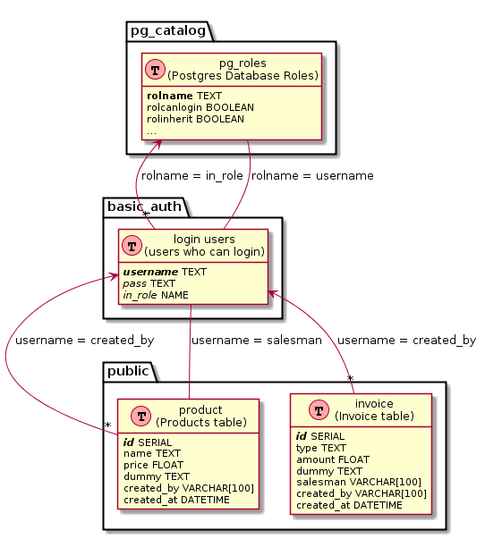

# postgrest-rls

A proof of concept stack that demonstrates a postgres database with PERMISSIONS and ROW LEVEL SECURITY ready to be integrated with "postgrest".

## Project Directory Structure
``` bash
.
├── database                     # database service
│   ├── Dockerfile
│   ├── extension                   # pgjwt extension files
│   │   ├── pgjwt--0.0.1.sql
│   │   └── pgjwt.control
│   └── initdb                      # database initialization scripts (SQL)
│       ├── 01_core_auth.sql           # implements authentication (schema, tables, functions)
│       ├── 02_app_schema.sql          # creates application databases
│       ├── 03_permissions_config.sql  # implements database roles and grants permissions
│       └── 04_fixtures.sql            # adds example data
├── docker-compose.yml
└─ README.md                 # this file
```

## Database (database service)
### Structure

```yaml
database: recruitment
    schema: public   # main data schema (for api access)
        table: product
            column: price
            column: row_role
            ...
        table: invoice
            column: amount
            column: salesman
            column: row_role
            ...

    schema: basic_auth  # authentication schema
        table: login_users
            column: username
            column: pass
            column: role
```

### Dependencies

**Extensions**
- pgcrypto
- pgjwt

### General

In order to initialize the database as desired, database initialization script SQL files are defined in _./database/initdb_.
Files get executed in alphabetical order by postgres after postgres is up.
Initialization scripts serve the purpose of defining:

1. **Core Authentication**  <!-- `01_core_auth.sql` -->
1. **Application Schema**  <!-- `02_app_schema.sql` -->
1. **Permissions Configuration**  <!-- `03_permissions_config.sql` -->
1. **Example Fixtures**  <!-- `04_fixtures.sql` -->

### Core Authentication

The core authentication script in file `./database/initdb/01_core_auth.sql` defines all the SQL statements and functions needed in order to implement **authentication** and **authorization** in an independent script thus facilitating _code reusability_.

It uses a seperate **schema** `basic_auth` and **table** `basic_auth.login_users` to store login users' data.

Defined users **MUST belong** to an **EXISTING database role** and are checked using a trigger on insert and update by function `basic_auth.check_role_exists` to have an existing database role.

Once a `login user` is defined a `database role` is created for that login user, in order to benefit from postgres `system information functions` such as **pg_has_role** used in ROW LEVEL SECURITY policies.

### Application Schema

Application schema is defined independently in file `./database/initdb/02_app_schema.sql` in which an example table `public.applicants` is defined.

Tables in schema `public` are application specific and follow application requirements.

#### Database Diagram 

Our example mostly makes use of the following `database tables`:



### Permissions Configuration

After defining authentication/ authorization mechanisms and the required application schema, **database roles** and **permission** are defined in file `./database/initdb/03_permissions_config.sql`.

Database roles (those which login users are assigned to) are defined in a flat or hierarchical style in accordance with the organizational role hierarchy.

Roles are granted/revoked permissions on database/schema/table/function... operations {insert, update, delete, select, use, execute ...} as well as Row level securtiy policies might be implemented as required by the application specifications.

In our example we added the following `database roles`:

| Role | Permissions | In Role
|----- | ----------- | --------
| accountant | read own, write to invoice | -
| salesman | read own write to product, read own invoice | -
| auditor | read product, invoice | -
| accounting_auditor | read invoice | auditor
| sales_auditor | read product, invoice | auditor
| manager | read own, write product, invoice | -

### Example Fixtures

In order to clearly demonstrate this demo, example data was added in file `./database/initdb/04_fixtures.sql`.

Some example `public.invoice`,`basic_auth.login_users` and `public.product` records where inserted and provided random **valid** values.


## Infrastructure

### Defined in docker-compose.yml

| Container | Port | Public Port | Links    |
| --------- | ---- | ----------- | -------- |
| database  | 5432 | -           | -        |

## How to run

```bash
$ docker-compose up -d --build 
```

## Testing

In order to carry tests, open a bash into the running 'database' container using:

```bash
$ docker-compose run database bash
bash-4.3# psql -h database -U postgres recruitment
Password for user postgres: # postgres
psql (9.5.7)
Type "help" for help.

```

### Testing Roles

```SQL
recruitment=> set role imad; -- salesman
SET
recruitment=> select * from invoice;
-- can view own records only where salesman = current_role (imad)
 id | type | amount  | dummy | salesman | row_role |         created_at
----+------+---------+-------+----------+----------+----------------------------
  2 | in   |  829997 |       | imad     | rawad    | 2017-08-07 08:15:25.566907
  3 | in   |    3232 |       | imad     | man      | 2017-08-07 08:15:25.567861
  7 | in   | 1723297 |       | imad     | jawad    | 2017-08-07 08:15:25.574362
(3 rows)

recruitment=> select * from product;
-- can view own records only where row_role = current_role (imad)
 id |     name     | price | dummy | row_role |         created_at
----+--------------+-------+-------+----------+----------------------------
  2 | caramel      |    14 |       | imad     | 2017-08-07 08:15:25.577553
  3 | carbon fiber |    37 |       | imad     | 2017-08-07 08:15:25.579552
  5 | carton       |     2 |       | imad     | 2017-08-07 08:15:25.582814
(3 rows)

recruitment=> update product set dummy = 'dum 1' where id =1 ;
-- cannot edit others records
UPDATE 0
recruitment=> update product set dummy = 'dum 2' where id =2 ;
-- can edit own records
UPDATE 1
recruitment=> set role rawad; -- accountant
SET
recruitment=> select * from product;
-- cannot view table product
ERROR:  permission denied for relation product
recruitment=> select * from invoice;
-- can view own records only where row_role = current_role (rawad)
 id | type | amount | dummy | salesman | row_role |         created_at
----+------+--------+-------+----------+----------+----------------------------
  2 | in   | 829997 |       | imad     | rawad    | 2017-08-07 08:15:25.566907
  5 | out  |  99097 |       | ziad     | rawad    | 2017-08-07 08:15:25.571303
(2 rows)

recruitment=> update invoice set dummy = 'dum 3' where id = 1;
-- cannot edit others records
UPDATE 0
recruitment=> update invoice set dummy = 'dum 4' where id = 5;
-- can edit own records
UPDATE 1
recruitment=> set role omar; -- accouting_auditor
SET
recruitment=> select * from product;
-- cannot view table product
ERROR:  permission denied for relation product
recruitment=> select * from invoice;
-- can see all records
 id | type | amount  | dummy | salesman | row_role |         created_at
----+------+---------+-------+----------+----------+----------------------------
  1 | out  | 3112197 |       | ziad     | jawad    | 2017-08-07 08:15:25.564469
  2 | in   |  829997 |       | imad     | rawad    | 2017-08-07 08:15:25.566907
  3 | in   |    3232 |       | imad     | man      | 2017-08-07 08:15:25.567861
  4 | out  | 1101097 |       | ziad     | jawad    | 2017-08-07 08:15:25.569863
  6 | out  |    4327 |       | ziad     | man      | 2017-08-07 08:15:25.57337
  7 | in   | 1723297 |       | imad     | jawad    | 2017-08-07 08:15:25.574362
  5 | out  |   99097 | dum 4 | ziad     | rawad    | 2017-08-07 08:15:25.571303
(7 rows)

recruitment=> update invoice set dummy = 'dum 5' where id = 3;
-- cannot edit records
ERROR:  permission denied for relation invoice
recruitment=> set role joe; -- sales_auditor
SET
recruitment=> select * from product;
-- can view table product
 id |     name     | price | dummy | row_role |         created_at
----+--------------+-------+-------+----------+----------------------------
  1 | car          | 10203 |       | ziad     | 2017-08-07 08:15:25.576441
  3 | carbon fiber |    37 |       | imad     | 2017-08-07 08:15:25.579552
  4 | carpet       |   250 |       | ziad     | 2017-08-07 08:15:25.580732
  5 | carton       |     2 |       | imad     | 2017-08-07 08:15:25.582814
  2 | caramel      |    14 | dum 2 | imad     | 2017-08-07 08:15:25.577553
(5 rows)

recruitment=>  update product set dummy = 'dum 6';
-- cannot edit table product
ERROR:  permission denied for relation product
recruitment=> select * from invoice;
-- can view table invoice
 id | type | amount  | dummy | salesman | row_role |         created_at
----+------+---------+-------+----------+----------+----------------------------
  1 | out  | 3112197 |       | ziad     | jawad    | 2017-08-07 08:15:25.564469
  2 | in   |  829997 |       | imad     | rawad    | 2017-08-07 08:15:25.566907
  3 | in   |    3232 |       | imad     | man      | 2017-08-07 08:15:25.567861
  4 | out  | 1101097 |       | ziad     | jawad    | 2017-08-07 08:15:25.569863
  6 | out  |    4327 |       | ziad     | man      | 2017-08-07 08:15:25.57337
  7 | in   | 1723297 |       | imad     | jawad    | 2017-08-07 08:15:25.574362
  5 | out  |   99097 | dum 4 | ziad     | rawad    | 2017-08-07 08:15:25.571303
(7 rows)

recruitment=>  update invoice set dummy = 'dum 7';
- cannot edit table invoice
ERROR:  permission denied for relation invoice
recruitment=> set role man;
SET
recruitment=> select * from product;
-- can view table product
 id |     name     | price | dummy | row_role |         created_at
----+--------------+-------+-------+----------+----------------------------
  1 | car          | 10203 |       | ziad     | 2017-08-07 08:15:25.576441
  3 | carbon fiber |    37 |       | imad     | 2017-08-07 08:15:25.579552
  4 | carpet       |   250 |       | ziad     | 2017-08-07 08:15:25.580732
  5 | carton       |     2 |       | imad     | 2017-08-07 08:15:25.582814
  2 | caramel      |    14 | dum 2 | imad     | 2017-08-07 08:15:25.577553
(5 rows)

recruitment=> update product set dummy = 'dum 8';
-- cannot edit any records
ERROR:  new row violates row-level security policy for table "product"
recruitment=> select * from invoice;
-- can view table invoice
 id | type | amount  | dummy | salesman | row_role |         created_at
----+------+---------+-------+----------+----------+----------------------------
  1 | out  | 3112197 |       | ziad     | jawad    | 2017-08-07 08:15:25.564469
  2 | in   |  829997 |       | imad     | rawad    | 2017-08-07 08:15:25.566907
  3 | in   |    3232 |       | imad     | man      | 2017-08-07 08:15:25.567861
  4 | out  | 1101097 |       | ziad     | jawad    | 2017-08-07 08:15:25.569863
  6 | out  |    4327 |       | ziad     | man      | 2017-08-07 08:15:25.57337
  7 | in   | 1723297 |       | imad     | jawad    | 2017-08-07 08:15:25.574362
  5 | out  |   99097 | dum 4 | ziad     | rawad    | 2017-08-07 08:15:25.571303
(7 rows)

recruitment=> update invoice set dummy = 'dum 9' where id = 1;
-- cannot edit others records
ERROR:  new row violates row-level security policy for table "invoice"
recruitment=> update invoice set dummy = 'dum 10' where id = 6;
-- can edit own records
UPDATE 1

```
